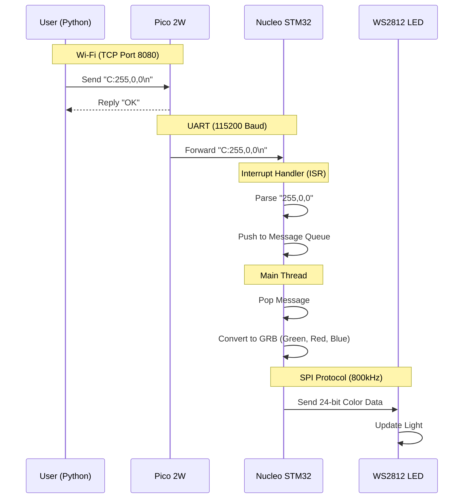

# 🎨 Wi-Fi LED System - Visual Architecture Guide

## 🌟 System Overview

```mermaid
graph TD
    User["User / Python Script"] -->|Wi-Fi (TCP)| Pico["Pico 2W (Modem)"]
    Pico -->|UART (Serial)| Nucleo["STM32 Nucleo (Controller)"]
    Nucleo -->|SPI (WS2812)| LED["RGB LED"]

    subgraph "Wireless Layer"
    User
    end

    subgraph "Bridge Layer"
    Pico
    end

    subgraph "Real-Time Layer"
    Nucleo
    LED
    end
```

---

## 🔌 Physical Wiring Diagram (Updated)

```
┌─────────────────────────┐         ┌─────────────────────────┐
│   Raspberry Pi Pico 2W  │         │  STM32 Nucleo-G070RB    │
│                         │         │                         │
│  ┌─────────────────┐    │         │    ┌─────────────────┐  │
│  │   GP0 (TX)      │────┼─────────┼───►│   D2 (RX)       │  │
│  │                 │    │         │    │   (PA10)        │  │
│  │   GP1 (RX)      │◄───┼─────────┼────│   D8 (TX)       │  │
│  │                 │    │         │    │   (PA9)         │  │
│  │   GND           │────┼─────────┼────│   GND           │  │
│  │                 │    │         │    │                 │  │
│  │   VBUS (5V)     │    │         │    │   5V            │──┼──┐
│  │                 │    │         │    │                 │  │  │
│  │                 │    │         │    │   PA7 (MOSI)    │──┼──┼──┐
│  └─────────────────┘    │         │    └─────────────────┘  │  │  │
│                         │         │                         │  │  │
│  USB-C (Power + Serial) │         │  USB-B (Power + Serial) │  │  │
└────────┬────────────────┘         └────────┬────────────────┘  │  │
         │                                   │                   │  │
         ▼                                   ▼                   │  │
    ┌────────┐                          ┌────────┐              │  │
    │    PC  │                          │    PC  │              │  │
    └────────┘                          └────────┘              │  │
                                                                 │  │
                                        ┌────────────────────────┘  │
                                        │                           │
                                        ▼                           ▼
                                   ┌─────────────────────────────────┐
                                   │      WS2812 RGB LED             │
                                   │                                 │
                                   │   VCC ◄─── 5V                   │
                                   │   GND ◄─── GND                  │
                                   │   DIN ◄─── PA7 (MOSI)           │
                                   └─────────────────────────────────┘
```

### **Pin Connection Table**

| From | Pin | Function | To | Pin | Function |
| :--- | :--- | :--- | :--- | :--- | :--- |
| **Pico** | GP0 | UART0 TX | **Nucleo** | **D2** (PA10) | USART1 RX |
| **Pico** | GP1 | UART0 RX | **Nucleo** | **D8** (PA9) | USART1 TX |
| **Pico** | GND | Ground | **Nucleo** | GND | Ground |
| **Nucleo** | PA7 | SPI1 MOSI | **WS2812** | DIN | Data Input |

---

## 🔄 Data Flow Sequence

### **Example: Setting LED to Red (255, 0, 0)**



---

## 🧠 Software Architecture

### **Pico 2W (The Modem)**
*   **Role:** Transparent Bridge
*   **Logic:**
    1.  Listen on TCP Port 8080
    2.  Receive Data
    3.  Send to UART (Raw)
    4.  No processing/parsing

### **Nucleo STM32 (The Brain)**
*   **Role:** Real-Time Controller
*   **Logic:**
    1.  **ISR:** Receive UART bytes → Buffer → Message Queue
    2.  **Main Loop:** Read Queue → Parse Command → Update LED
    3.  **Safety:** Decoupled ISR from LED update to prevent Kernel Panic

---

## 📊 Protocol Stack

```
┌─────────────────────────────────────────────────────────────┐
│                    APPLICATION LAYER                         │
│  Command: "C:R,G,B" (ASCII Text)                            │
└──────────────────────┬──────────────────────────────────────┘
                       │
┌──────────────────────▼──────────────────────────────────────┐
│                    TRANSPORT LAYER                           │
│  TCP/IP (Wi-Fi)                                             │
└──────────────────────┬──────────────────────────────────────┘
                       │
┌──────────────────────▼──────────────────────────────────────┐
│                    SERIAL LAYER                              │
│  UART (115200, 8N1)                                         │
└──────────────────────┬──────────────────────────────────────┘
                       │
┌──────────────────────▼──────────────────────────────────────┐
│                    PHYSICAL LAYER                            │
│  SPI (WS2812 Protocol - 800kHz)                             │
└─────────────────────────────────────────────────────────────┘
```
